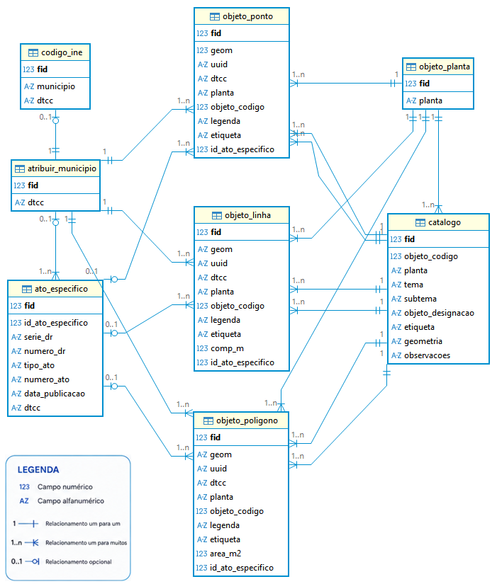

# Modelo de Dados da PDM

Para apoio à criação e configuração da base de dados do PDM a Direção-Geral do Território desenvolveu um modelo de dados (MD) no formato aberto da OGC, [GeoPackage](https://www.geopackage.org/) (GPKG), que se encontra disponível para descarregamento neste repositório.

Descrição do conteúdo das pastas e ficheiros do repositório:

* `estilos` - diversos ficheiros com a simbologia dos objetos para QGIS

* `media` - pasta de imagens associadas README.md 

* modelo > `PDM_modelo.qgs` - projeto modelo para criação da base de dados

* modelo > `pdm_modelo_gpkg.gpkg` - modelo da base de dados em GeoPackage

* plugin_qgis > `pdm_importar_md.zip` - plugin para converter os dados de origem para o modelo

* sql > `pdm_modelo_gpkg.gpkg.sql` - contém a estrutura da base de dados modelo, descrevendo as tabelas, vistas e triggers para cálculo automático de áreas e comprimentos

* sql > `pdm_modelo_postgres.sql` - versão da estrutura da base de dados modelo para PostgreSQL/PostGIS

* sql > `pdm_modelo_postgres_multi_dtcc.sql` - versão da estrutura da base de dados modelo para PostgreSQL/PostGIS com permissão para multiplos DTCC

* `LICENSE` - Licença de utilização de software livre GNU AGPLv3

* `README.md` - Explicação do conteúdo da página Proposta de melhoria do Modelo de Dedos do PDM em GeoPackage

---

## [**Plugin QGIS para carregar dados para Modelo de Dados do PDM**](plugin_qgis)

Para apoio aos utilizadores na criação de ficheiros Geopackage de acordo com o Modelo de Dados do PDM, é disponibilizado gratuitamente pela Direção-Geral do Território um plugin para o software livre QGIS. [Clique aqui](plugin_qgis).

---

## Estrutura da Base de Dados

### Tabelas
- `codigo_ine`  
   Lista os municípios e respetivos códigos da divisão administrativa do Instituto Nacional de Estatística (código DTCC).
- `atribuir_concelho`  
   Identifica o município de trabalho do utilizador. Esta tabela contém um único registo e funciona como elemento de configuração, centralizando a identificação do território a que os dados se referem através do código DTCC. O respetivo código atua como chave estrangeira nas tabelas gráficas, garantindo a integridade referencial. Qualquer alteração ao registo é automaticamente refletida nas tabelas dependentes, assegurando a associação de todos os dados ao mesmo município.
- `objeto_planta`  
   Define os planos disponíveis (`Condicionantes`, `Ordenamento`).
- `catalogo`  
   Identifica os objetos que podem existir na base de dados, a natureza geométrica que cada objeto pode assumir e a sua organização em cada planta do plano.
- `objeto_ponto`  
   Objetos espaciais do tipo **ponto**, com trigger para gerar automaticamente o UUID.
- `objeto_linha`  
   Objetos espaciais do tipo **linha**, com triggers para:
  - gerar UUID;
  - calcular automaticamente o comprimento (`comp_m`) em metros.
- `objeto_poligono`  
   Objetos espaciais do tipo **polígono**, com triggers para:
  - gerar UUID;
  - calcular automaticamente a área (`area_m2`) em m2.
- `ato_especifico`  
   Regista atos administrativos associados a determinada geometria.

> [Abrir correspondência de campos entre modelo de dados e a versão anterior](info/compara_modelo_dados_ren.md).

---

### Vistas auxiliares

Foram criadas **vistas auxiliares** para facilitar consultas:

- `catalogo_ord` **/** `catalogo_cond`: objetos classificados por planta.
- `catalogo_ord_pt/ln/pl` e `catalogo_cond_pt/ln/pl`: objetos filtrados por geometria (ponto, linha, polígono).

---

### Triggers de Cálculo Automático

- **Áreas (**`area_m2`**)**: calculadas automaticamente em todas as tabelas com geometrias poligonais.
- **Comprimentos (**`comp_m`**)**: calculados automaticamente em tabelas com geometrias lineares.
- **Atualização automática** em caso de atualização da geometria.

---

## Observações Técnicas

- **Codificação:** UTF-8.
- **UUIDs:** gerados automaticamente nas tabelas geométricas.
- **Área:** armazenada em **m²**.
- **Comprimento:** armazenado em **metros**.

> Algumas funcionalidades (como colunas `GENERATED ALWAYS`) requerem **SQLite ≥ 3.31**.

---
