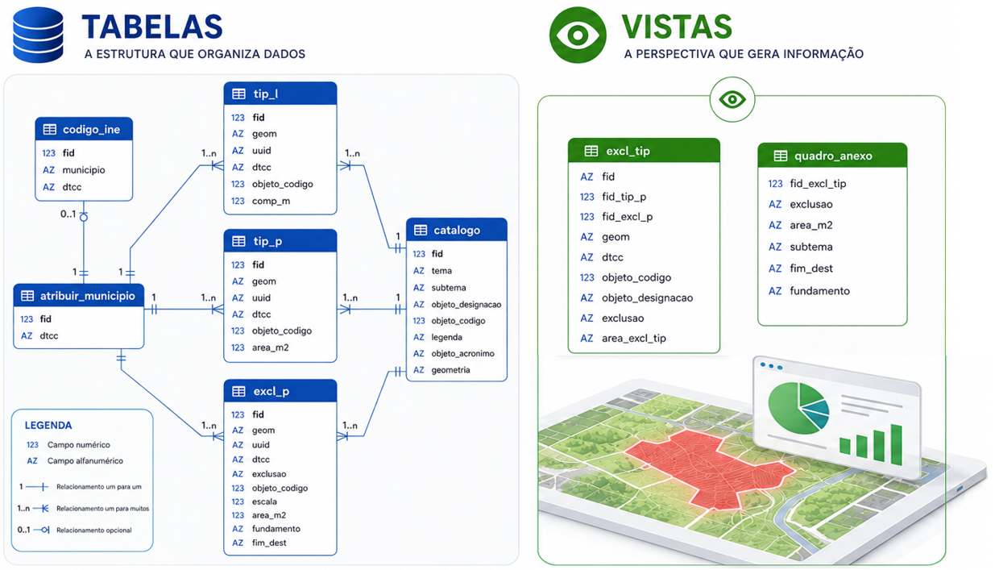

# Modelo de Dados da REN

Para apoio à criação e configuração da base de dados da REN a Direção-Geral do Território desenvolveu um modelo de dados (MD) no formato aberto da OGC, [GeoPackage](https://www.geopackage.org/) (GPKG), que se encontra disponível para descarregamento neste repositório.

Descrição do conteúdo das pastas e ficheiros do repositório:

* `estilos` - diversos ficheiros com a simbologia dos objetos para QGIS

* `media` - pasta de imagens associadas README.md 

* modelo > `REN_modelo.qgs` - projeto modelo para criação da base de dados

* modelo > `ren_modelo_gpkg.gpkg` - modelo da base de dados em GeoPackage

* plugin_qgis > `ren_importar_md.zip` - plugin para converter os dados de origem para o modelo

* sql > `ren_modelo_gpkg.gpkg.sql` - contém a estrutura da base de dados modelo, descrevendo as tabelas, vistas e triggers para cálculo automático de áreas e comprimentos

* sql > `ren_modelo_postgres.sql` - versão da estrutura da base de dados modelo para PostgreSQL/PostGIS

* sql > `ren_modelo_postgres_multi_dtcc.sql` - versão da estrutura da base de dados modelo para PostgreSQL/PostGIS com permissão para multiplos DTCC

* `LICENSE` - Licença de utilização de software livre GNU AGPLv3

* `README.md` - Explicação do conteúdo da página Proposta de melhoria do Modelo de Dados da REN em GeoPackage

---

## [**Plugin QGIS para carregar dados para Modelo de Dados da REN**](plugin_qgis)

Para apoio aos utilizadores na criação de ficheiros Geopackage de acordo com o Modelo de Dados da REN, é disponibilizado gratuitamente pela Direção-Geral do Território um plugin para o software livre QGIS. [Clique aqui](plugin_qgis).

---

## Estrutura da Base de Dados

### Tabelas

- `codigo_ine`
   Lista os municípios e respetivos códigos da divisão administrativa do Instituto Nacional de Estatística (código DTCC).
- `atribuir_concelho`
   Identifica o município de trabalho do utilizador. Esta tabela contém um único registo e funciona como elemento de configuração, centralizando a identificação do território a que os dados se referem através do código DTCC. O respetivo código atua como chave estrangeira nas tabelas gráficas, garantindo a integridade referencial. Qualquer alteração ao registo é automaticamente refletida nas tabelas dependentes, assegurando a associação de todos os dados ao mesmo município.
- `catalogo`
   Identifica os objetos que podem existir na base de dados, a natureza geométrica que cada objeto pode assumir e a sua organização na carta da REN.
- `tip_l`
   Objetos espaciais do tipo **linha**, com triggers para:
  - gerar UUID;
  - calcular automaticamente a área (`comp_m`) em m2.
- `tip_p`
   Objetos espaciais do tipo **polígono**, com triggers para:
  - gerar UUID;
  - calcular automaticamente a área (`area_m2`) em m2.
- `excl_p`
   Objetos espaciais do tipo **polígono** para **exclusões**, com triggers para: 
  - gerar UUID;
  - calcular automaticamente a área (`area_m2`) em m2.

---

### Vistas

Permitem a análise e consulta dos dados do catálogo de objetos e do quadro anexo à carta de delimitação da REN:

- `excl_tip`  
   Vista de apoio (view); Identifica as diferentes tipologias abrangidas por cada exclusão. Esta vista resulta de uma query SQL que calcula a interseção espacial entre as geometrias das tabelas tip_p e excl_p com o mesmo DTCC. Como resultado, são gerados os polígonos correspondentes às áreas de sobreposição, preservando os atributos das respetivas tabelas de origem e calculando a área de cada interseção.
- `quadro_anexo`  
   Vista de apoio (view); Agrega a informação necessária à elaboração do Quadro Anexo publicado no Diário da República, identificando, para cada exclusão, as tipologias REN abrangidas, a superfície excluída, a fundamentação e o fim a que se destina. Esta vista resulta de uma query SQL que relaciona e agrega atributos da vista excl_tip e das tabelas excl_p e catalogo.

Diagrama da Base de dados

> [Abrir correspondência de campos entre modelo de dados e a versão anterior](info/compara_modelo_dados_pdm.md).

---

### Vistas auxiliares

Foram criadas **vistas** para facilitar consultas e utilização do plugin:

- `catalogo_tip_l`  
   Lista os objetos com geometria linear que correspondem às tipologias.
- `catalogo_tip_p`  
   Lista os objetos com geometria poligonal que correspondem às tipologias.
- `catalogo_excl_p`  
   Lista os objetos com geometria poligonal que correspondem às exclusões.

---

### Triggers de Cálculo Automático

- **Áreas (**`area_m2`**)**: calculadas automaticamente em todas as tabelas com geometrias poligonais.
- **Comprimentos (**`comp_m`**)**: calculados automaticamente em tabelas com geometrias lineares.
- **Atualização automática** em caso de atualização da geometria.

---

## Observações Técnicas

- **Codificação:** UTF-8.
- **UUIDs:** gerados automaticamente nas tabelas geométricas.
- **Área:** armazenada em **m²**.
- **Comprimento:** armazenado em **metros**.

> Algumas funcionalidades (como colunas `GENERATED ALWAYS`) requerem **SQLite ≥ 3.31**.

---
