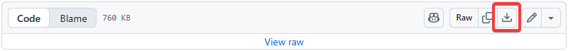
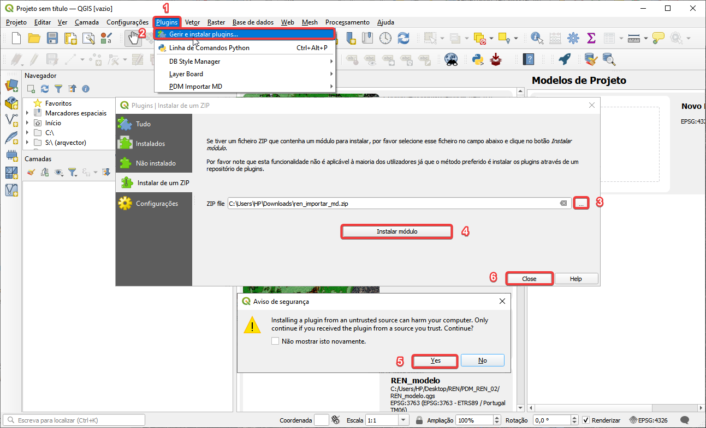
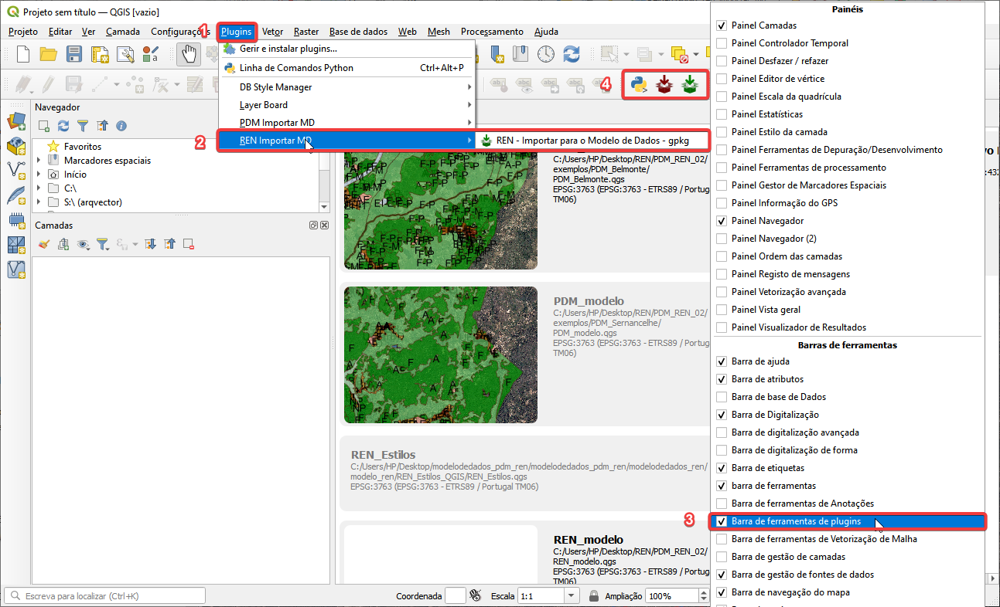
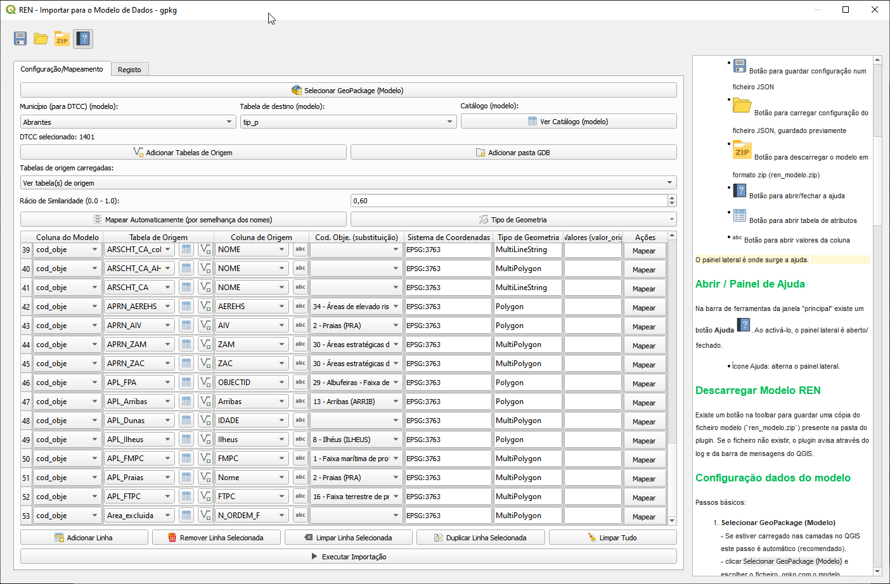
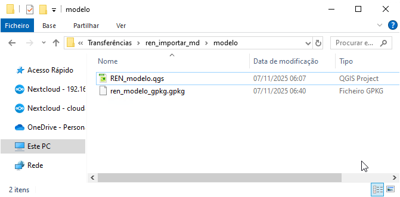

# Plugin QGIS para carregar dados para Modelo de Dados da REN (Em Atualização)

Para apoio aos utilizadores na criação de ficheiros Geopackage de acordo com o Modelo de Dados da REN proposto, é disponibilizado gratuitamente pela Direção-Geral do Território um plugin para o software livre [QGIS](https://qgis.org/) .

Este plugin permite auxiliar o utilizador a estruturar e carregar de forma interativa os seus dados geográficos existentes noutros formatos e com diferentes estruturas de informação para um ficheiro geopackage com toda a informação da REN em conformidade com o modelo de dados proposto.

---

## Instalar o Plugin QGIS

1. Descarregar e guardar no computador o plugin `ren_importar_md.zip` [(localizado em plugin_qgis)](ren_importar_md.zip)

   - [Descarregar ficheiro `.zip`](https://github.com/dgterritorio/modelodedados_pdm_ren/raw/refs/heads/main/modelosdedados/ren/plugin_qgis/ren_importar_md.zip)

2. Abrir o QGIS (recomenda-se uma versão igual ou superior a 3.44)

3. Instalar o Plugin > ver imagem seguinte

   - O plugin fica disponivel no separador `Plugins` e na `Barra de ferramentas de plugins` no botão 

Aspeto da interface do plugin

---

## Utilização do Plugin QGIS

> Antes de mapear os objetos, deve verificar inicialmente no mapa se a informação está devidamente georreferenciada no sistema de coordenadas oficial - EPSG:3763 - ETRS89 / Portugal TM06.

O procedimento para a conversão de uma base de dados de origem para a base de dados modelo é o seguinte:

1. Descarregar o ZIP clicando no botão  do plugin ou descarregar do repositório a pasta `modelo` para o computador e abrir o projeto REN_modelo.qgs

   - Recomendamos que os ficheiros fiquem na mesma pasta.

   - 

2. Selecionar o plugin REN_importar_MD no Separador Plugins ou na Barra de ferramentas

3. Executar o PlugIn > [**ver vídeo seguinte**](media/plugin.mp4) 

4. Gerar a sobreposição das tipologias com as exclusões (ativar o excl_tip)

5. Visualizar o Quadro Anexo

6. Visualizar o Ato de Publicação
